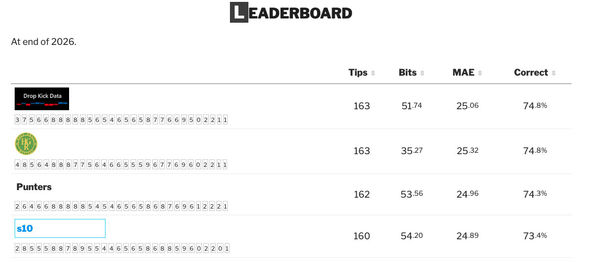
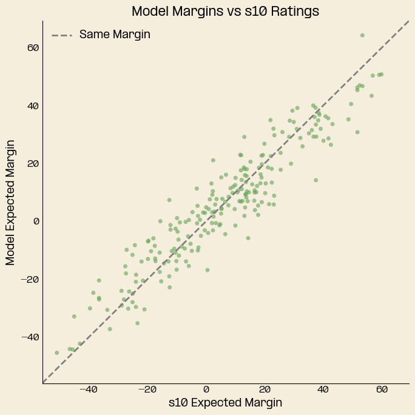
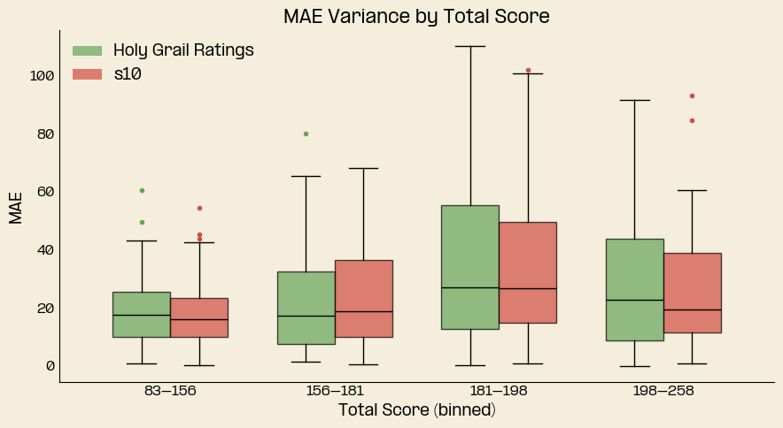
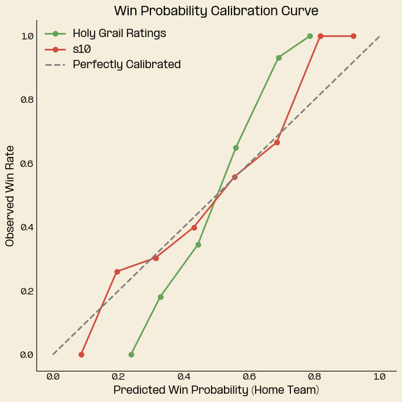

With the grand final taking place last Saturday, my first year submitting tips to [Squiggle](https://squiggle.com.au/) has come to an end. It was a pleasantly surprising season, with the model finishing equal first for most tips and performing well in all metrics except bits (more on that later).

My intuition for why the model performed well is its heavy weighting toward Xscore, which seemed to be a good predictor of future performance this year, and a decision not to include player ratings in the Squiggle tips.[^1]

The importance of players seemed a particular red herring this year, best emphasised by the Swans, who absorbed the absence of key players with ease. In fact, of the 5 biggest differences between Squiggle's s10 (average of last years best ten models) and the Punters[^2], 4 were associated with key outs![^3]

```{python}
from IPython.display import HTML

with open("PuntersVsSquiggle.html") as f:
    display(HTML(f.read()))

```


In all but one of these games the models forecasts were more accurate than the Punters! It's hard to pin down a reason, but a few possible explanations come to mind: the importance of team systems in the modern game, the high quality of the average player today, or simply variance.

To wrap up the year, I wanted to take a slightly closer look at the HGR model's performance for 2026 across Squiggle's metrics and look toward some potential improvements for 2027.

## Tips

Tips were a strong spot for the model in 2026, though it is the weakest measure of the model's quality, as they don't capture how strongly a side was favoured by the tipster. Regardless, it was nice to come out equal first.

A fun way to look back on the year is to see which games helped the model get ahead, in particular those where the model held the most contrarian view. This table shows the games where the model tipped against the rest of the field and the resulting outcomes.

```{python}
from IPython.display import HTML

with open("MostContrarian.html") as f:
    display(HTML(f.read()))

```


Round 11 saw the model stand against the field to tip the Tigers to beat the Bombers, which paid off. It was one of just 8 times this season where only one model tipped the winning side! Credit should be given to What Snoo Thinks' model, which was the only model to do it twice.

## MAE

Mean absolute error (MAE) is the variable I optimise for when developing the model, so to finish 9th (12th including aggregate models) was a great result. By round, the model was fairly close to the s10, with only a few rounds where the model registered higher error. The biggest indication of a need for improvement is that the model ranked 13th (16th including aggregate models) in root mean squared error (RMSE), which penalises big misses more heavily than MAE. 

This year the model produced more conservative margins than other models, underestimating the frequency of big margins. The chart below shows that the model consistently tipped tighter margins compared to the s10, particularly where the s10 forecasted a blowout.



The other area of improvement relates to total score. Currently the model makes no adjustments for the expected total score. The model currently experiences greater variance in margin error at higher totals when compared to the s10, though both grow with as total score increases.



Accounting for total score won't matter so much for expected margins, but it will have an impact on win probabilities. This brings me to the final metric, bits.

## Bits

Along with MAE, Bits is the best indicator of whether a model is good, effectively measuring the calibration of the model's win probabilities. Unsurprisingly to me, the model finished dead last, as I had not refit the win probability function to account for some new model updates and ran out of time before the start of the season. In the background of the season I reworked the win probability calculation but decided to let the existing calculation run as it was too late to salvage my bits score. 

To visualise just how far off the model was this year, look at this chart, it shows the model's win probabilities against the observed win rate. The S-shape of the curve tells us the model was too conservative in its win probabilities, underestimating the odds of big favourites winning, and overestimating the likelihood of underdogs wining.



I've already looked into improving this win probability function, and have built a solution. The last remaining change will be to incorporate the output of a total score model, which is necessary to account for the higher variance of games with large totals.

## Looking Forward to 2027

Next year will see an expanded offering on the blog. The plan so far is to add:
- Total Score
- Player Rankings
- AFLW

Finally, a big thank you to Max Barry at Squiggle.com for organising and administering the Squiggle competition. I had a great time following along and participating.

[^1]: I initially planned to include my player ratings in the model.
[^2]: Punters is a combination of bookmakers' odds and lines.
[^3]: The other being the outrageous ~74 point line for the Dogs to beat the Dons.