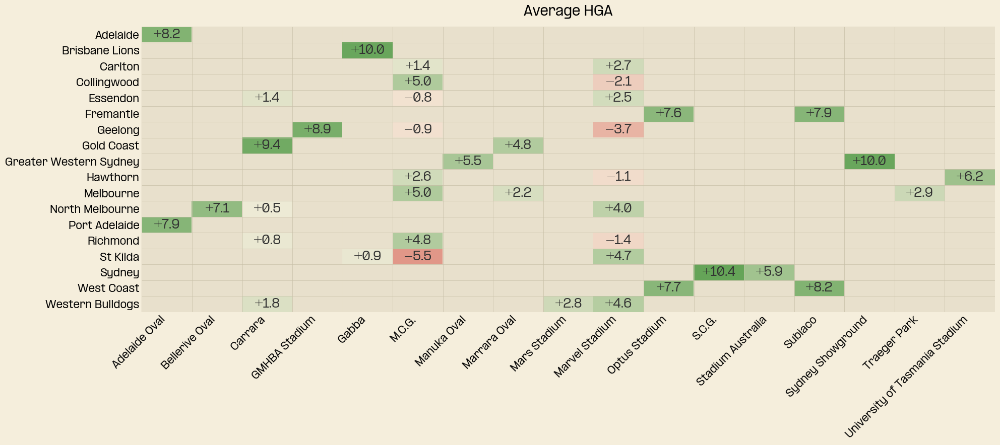

# 2026 State of the Model Address

Well it’s Round 0 eve, and I’m excited to be back for another year. In this post I dive into what you can expect to be posted on the blog this year and a summary of what goes into the model this year.

# What to expect on HGR this year

As with last year I will continue to post my tips each week along with the rating of each team after every round. A major addition here is the addition of player ratings into tips, I will include these in the model and post them after the release of lineups.

This year I’m fortunate to have some more time on my hands, and logically the place to channel it is more footy content. Last year, due to time constraints, I spent most of my time working on model developments and didn’t get time to write anything up. 

The goal this year is to turn some of that research into content. Content this year will be focused mainly on modelling and AFL betting markets, but I hope to develop some more analytical content as well. 

Web updates should also roll in throughout the season, so stay posted!

# The state of the model address

Over the last year I’ve made a significant amount of model progress, partly due to the increased capability of AI which has dramatically reduced the amount of boiler plate code which I’ve needed to write.

Model error has come down significantly from last year, thanks to some sizeable improvements. There are now three components driving the model this year:

## ODELO

ODELO remains functionally the same as last year, you can read more about it [here](/posts/Intro/Introduction.html). I’ve mainly made improvements to optimisation which has reduced error slightly, namely K-factor, which was previously a bit of a hack job, but you can read more about that in this post link [here](/posts/KFactor/Kfactor.html).

## Home Ground Advantage (HGA)
An exciting addition to the model this year is the addition of home ground advantage. You can expect a more detailed analysis of home ground advantage some time this season, but in brief, has been modelled using a walk forward multiple regression. 

In keeping with Matter of Stats convention, the HGA is more akin to a venue advantage, given the idiosyncrasies of home and away status for teams. Nonetheless the listed home team retains a home ground advantage in 82% of games. Exceptions to this rule are what you might expect, for example Collingwood away at the MCG. 

The average HGA values for 2024-2025 are in the table below, note that the HGA is dependent on opponent so these values are intended only as a summary.



## PlayOn – Player Based Modelling

Another exciting addition this year is a new model I’m calling PlayOn, a solution to modelling players. The goal of this model is to forecast a player’s AFL rating points in a game, since the difference of the sums of each team’s ratings is highly correlated with the margin.  This model is still a work in progress but is based on a player’s form over their career. Ratings are then standardised by position using a value over replacement calculation, that is how much better a player is than an average player at their position.

This rating system lacks some key adjustments which will be the target of future improvements. Ratings haven’t been standardised for time, so ratings haven’t been decayed since a player’s last game, hence ratings tend to be inflated for player’s who did not play finals or those who were flying high before an injury (see Nic Martin). Positional adjustment is also a vulnerability given the dynamic natuer of modern positions, regardless, a starts a start.

As it stands though the top 5 rated players as of the end of 2025 are:

```{python}
from IPython.display import HTML

with open("top5_players_table.html") as f:
    display(HTML(f.read()))

```

At the moment PlayOn works best as a sort of directional correction when key players are missing from lineups or for significant personnel change between seasons, and is run independently of ODELO. 

I look forward to exploring player modelling more this year as I’ve been inspired by other sports’ player ratings systems, in particular NBA’s DARKO.

# Model Performance

After these adjustments the model error is significantly lower, the table below compares the MAE of the new model versus the old.

```{python}
from IPython.display import HTML

with open("mae_table.html") as f:
    display(HTML(f.read()))

```


The model is now in a far better place, incorporating most of the main ideas already incorporated in the great models over at Squiggle. With all of this in place I can get to exploring some more novel ideas, so please stay tuned, and have a happy Round 0 eve!
